  

  

  <b>Hi, I'm Ruth Bermudez.</b> 
  I'm a student who loves turning ideas into real projects, leading teams and learning new tools along the way.

 

  

- **Student** with a strong passion for projects that make a real impact.
- **Natural leader:** I enjoy organizing teams, setting goals and helping everyone do their best work.
- **Excellent English:** I communicate clearly in both written and spoken form.
- **Always learning:** curious, organized and committed to finishing what I start.

 

  

I led my group in **Health Boost**, a project focused on integral wellbeing. As team leader I coordinated the work, shared responsibilities, prepared the presentation and guided my teammates through the final expo.

 

  

| Area | Details |
|---|---|
| **Microsoft Excel** | Certified twice |
| **Python** | Programming fundamentals and problem solving |
| **English** | Excellent level, written and spoken |
| **Leadership** | Team coordination, public speaking, planning |
| **Teamwork** | Collaboration, communication, responsibility |

 

  

- Building my GitHub portfolio with real projects.
- Improving my Python skills step by step.
- Taking on new leadership challenges in school projects.

 

  

