  
  

 

**Hi, I'm Ruth Bermudez.** I'm a student who loves turning ideas into real projects, leading teams and learning new tools along the way.

 

### Who I am

- Student with a strong passion for projects that make a real impact.
- Natural leader: I enjoy organizing teams, setting goals and helping everyone do their best work.
- Excellent English: I communicate clearly in both written and spoken form.
- Always learning: curious, organized and committed to finishing what I start.

### Leadership experience

I led my group in **Health Boost**, a project focused on integral wellbeing. As team leader I coordinated the work, shared responsibilities, prepared the presentation and guided my teammates through the final expo.

### Certifications and skills

| Area | Details |
| :--- | :--- |
| Microsoft Excel | Certified twice |
| Python | Programming fundamentals and problem solving |
| English | Excellent level, written and spoken |
| Leadership | Team coordination, public speaking, planning |
| Teamwork | Collaboration, communication, responsibility |

### What I'm working on

- Building my GitHub portfolio with real projects.
- Improving my Python skills step by step.
- Taking on new leadership challenges in school projects.

 

> "Great things are done by a series of small things brought together."
